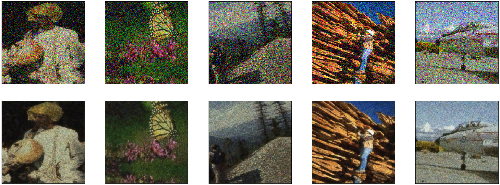
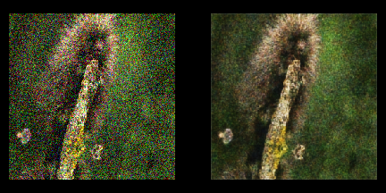
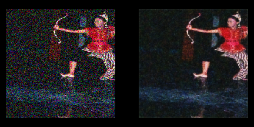
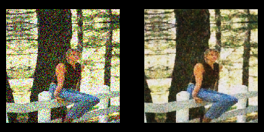
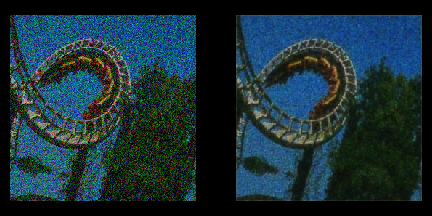

# Deep Convolutional Denoising Autoencoder

   
This project is an implementation of a Deep Convolutional Denoising Autoencoder to denoise corrupted images. The noise level is not needed to be known. Denoising helps the autoencoders to learn the latent representation present in the data. Denoising autoencoders ensures a good representation is one that can be derived robustly from a corrupted input and that will be useful for recovering the corresponding clean input.

## Table of Contents
* [Requirements](#requirements)
* [Dataset](#dataset)
* [Model Architecture](#model-architecture)
* [Data Augmentation](#data-augmentation)
* [Running](#running)
* [Results](#results)
* [References](#references)

## Requirements
+ Python >= 3.5  
+ Keras >= 2.2.4   
+ PIL  
+ Numpy  
+ Matplotlib  
+ Jupyter Notebook
  
  
## Dataset
I used [Berkeley Segmentation Data Set and Benchmarks 500 (BSDS500)](https://www2.eecs.berkeley.edu/Research/Projects/CS/vision/grouping/resources.html). It contains 500 RGB images, 200 for training, 100 for validation and 200 for test. Images come in different sizes.  

## Model Architecture  
The architecture somewhat resembles U-Net, an encoder-decoder network with skip connections between mirrored layers in the encoder and decoder stacks. The network consists of convolutional, dropout and batch normalization layers LeakyReLU used as the activation function. One of notable differences between this model and UNet is that it uses strided convolutions and transposed convolutions instead of pooling and upsampling layers.   

## Data Augmentation  
#### ImageDataGenerator and Random Cropping
This part had the biggest challenge. Since we're using a very small set for training, it is imparative to have good image augmentations. Keras' `ImageDataGenerator` class comes with different functionalities but it lacks an important one: random cropping. Since the images have different sizes, it is not optimal to resize them to a fixed size that would result in  deformation and degrading images.  
I dug into Keras' source code and found that a function called `load_img` referenced as `keras.preprocessing.image.image.load_img` takes care of loading images and then immediately resizing them to a specifed size. So defind my own function that performs random cropping and overrided it with the original function.  
#### Additive Gaussian Noise  
During training process, gaussian noises of different standard deviations are added to the inputs. The standard deviation is itself a random parameter and follows an exponential distribution.  

## Running  
The notebook is pretty straightforward. It comes in 5 sections: **Setup, DataGenerator, Model, Train and Evalutation.** Run the cells consecutively. Hyperparameters are in the Setup section.  
  
## Results  
The model achived 86% accuracy on the validation set, considering it was only trained on 200 images. Here are the results of the test set:  

### <pre>      Input                Output</pre>
  
   
  
  
  

## References  
1. [Person-Segmentation-Keras](https://github.com/TianzhongSong/Person-Segmentation-Keras)
2. [Image Denoising with Generative Adversarial Network
](https://github.com/manumathewthomas/ImageDenoisingGAN)
3. [Image Restoration Using Convolutional Auto-encoders with Symmetric Skip Connections](https://arxiv.org/pdf/1606.08921.pdf)
4. [Extending Keras' ImageDataGenerator to Support Random Cropping](https://jkjung-avt.github.io/keras-image-cropping/)
5. [Mnist denoising autoencoder](https://keras.io/examples/mnist_denoising_autoencoder/)
